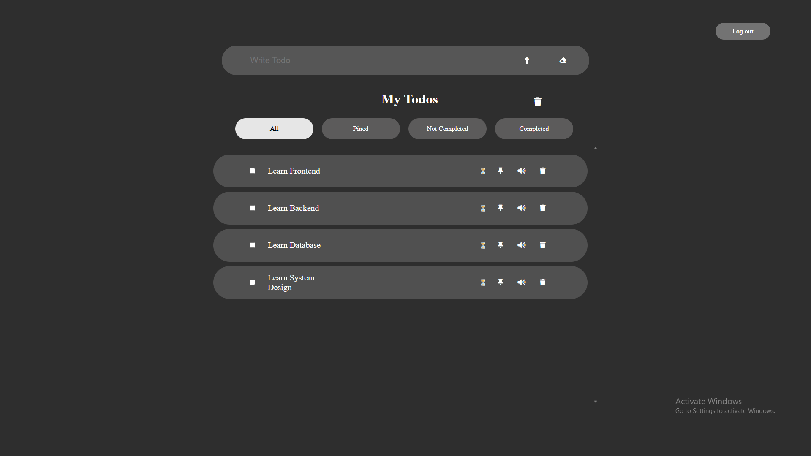
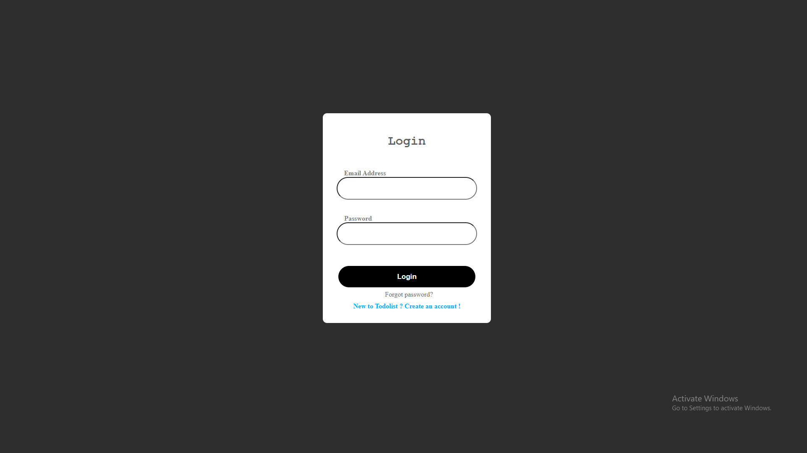
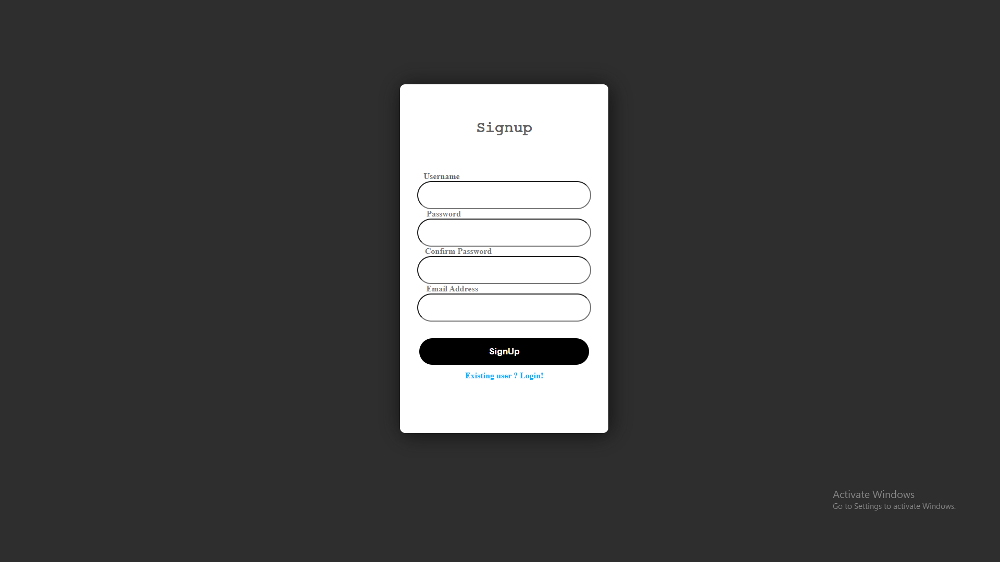

<h1>📝 Todo List App</h1>

  

    A full-stack <strong>Todo List Application</strong> built as a learning and personal project.
    This app helps users manage daily tasks with authentication and protected routes.
  

  

  <h2>🔗Site is Live</h2>
  <ul>
    <li>
      Frontend:
      <a href="https://todo-list-amber-three-37.vercel.app/" target="_blank">
        https://todo-list-amber-three-37.vercel.app/
      </a>
    </li>
    <li>
      Backend API:
      <a href="https://todolist-23zy.onrender.com" target="_blank">
        https://todolist-23zy.onrender.com
      </a>
    </li>
  </ul>

  

  <h2>🚀 Features</h2>
  <ul>
    <li>User Signup & Login</li>
    <li>Create, update, and delete todos</li>
    <li>Todo filters:
      <ul>
        <li>All todos</li>
        <li>Completed todos</li>
        <li>Not completed todos</li>
        <li>Pinned todos</li>
      </ul>
    </li>
    <li>Protected routes (authentication required)</li>
  </ul>

  

  <h2>🛠️ Tech Stack</h2>

  <h3>Frontend</h3>
  <ul>
    <li>React (Vite)</li>
  </ul>
  <h3>dependencies(frontend)</h3>
    <ul>
        <li>axios</li>
        <li>browser-router</li>
        <li>react</li>
        <li>react-dom</li>
        <li>react-router-dom</li>
    </ul>
  <h3>Backend</h3>
  <ul>
    <li>Node.js</li>
    <li>Express.js</li>
    <li>MongoDB Atlas</li>
    <li>Mongoose</li>
  </ul>
    <h3>dependencies(backend)</h3>
      <ul>
        <li>express</li>
        <li>nodemon</li>
        <li>cors</li>
        <li>dotenv</li>
        <li>bcryptjs</li>
        <li>mongodb</li>
        <li>mongoose</li>
    </ul>

  

  <h2>📸 Screenshots</h2>
  

    
    
    

  

  

  <h2>⚙️ Environment Variables</h2>
  <h3>Frontend (.env)</h3>
  <pre>
    VITE_API_BASE_URL=your_backend_url
  </pre>

  <h3>Backend (.env)</h3>
  <pre>
    PORT=5000
    MONGODB_URL=your_mongodb_connection_string
  </pre>

  

<h3>💡 Suggested Enhancements</h3>
<ul>
  <li>Add Light Theme / Dark Theme toggle</li>
  <li>Implement JWT authentication with access & refresh tokens</li>
  <li>Improve UI/UX with animations</li>
  <li>Add search and advanced filters</li>
  <li>Add due dates and reminders for todos</li>
  <li>Improve error handling and validations</li>
</ul>

  

  

    ⭐ If you like this project, Hit the Star Button!
  

